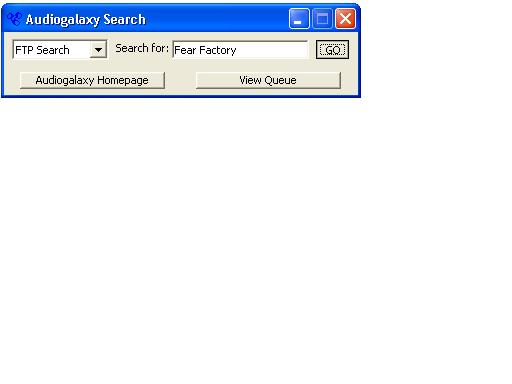



## Audiogalaxy Search Tool

### Description

Search audiogalaxy from a standalone program. Compatible with both AG search types, can also view your mp3 queue.
 
### More Info
 

             |
---                |---
**Submitted On**   |2001-10-18 20:19:44
**By**             |[Matt Hines](https://github.com/Planet-Source-Code/PSCIndex/blob/master/ByAuthor/matt-hines.md)
**Level**          |Intermediate
**User Rating**    |5.0 (10 globes from 2 users)
**Compatibility**  |VB 6\.0
**Category**       |[Internet/ HTML](https://github.com/Planet-Source-Code/PSCIndex/blob/master/ByCategory/internet-html__1-34.md)
**World**          |[Visual Basic](https://github.com/Planet-Source-Code/PSCIndex/blob/master/ByWorld/visual-basic.md)
**Archive File**   |[Audiogalax2979810182001\.zip](https://github.com/Planet-Source-Code/matt-hines-audiogalaxy-search-tool__1-28235/archive/master.zip)

